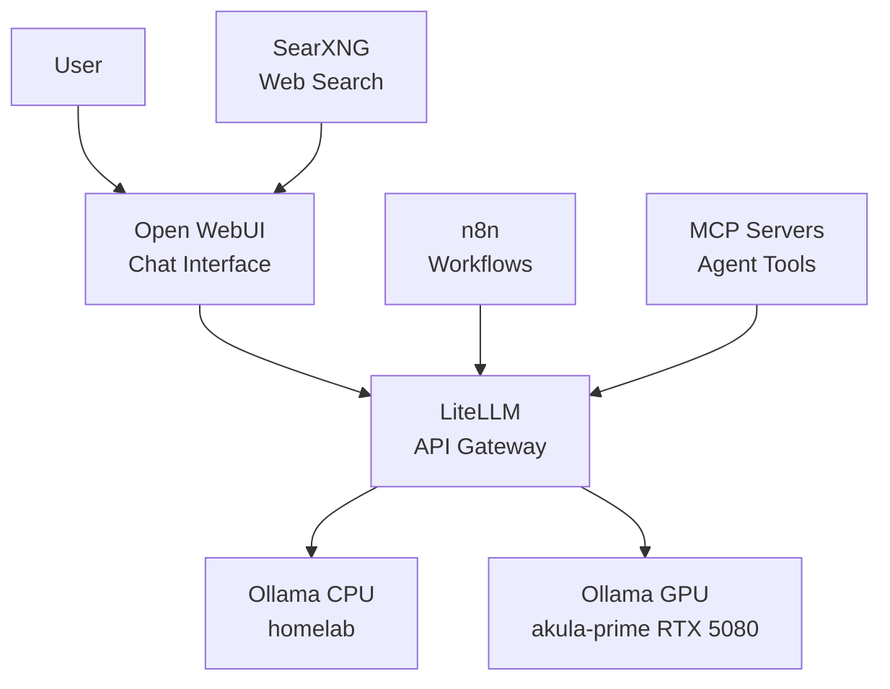

# AI Services

## Architecture

## Services

| Service | Purpose | URL |
|---------|---------|-----|
| **Open WebUI** | Chat interface with RAG | [ai.vectorweight.com](https://ai.vectorweight.com) |
| **LiteLLM** | OpenAI-compatible API gateway | [llm.vectorweight.com](https://llm.vectorweight.com) |
| **Ollama** | LLM inference (CPU + GPU) | Internal ClusterIP |
| **SearXNG** | Privacy-focused web search | [search.vectorweight.com](https://search.vectorweight.com) |
| **n8n** | Workflow automation | [n8n.vectorweight.com](https://n8n.vectorweight.com) |
| **MCP Servers** | AI agent tools | Internal ClusterIP |

## Inference Path

1. User sends message via Open WebUI or LiteLLM API
2. LiteLLM routes to appropriate Ollama instance (CPU or GPU)
3. Ollama loads model and generates response
4. Response returned through LiteLLM to user

## GPU vs CPU Inference

| Feature | CPU (homelab) | GPU (akula-prime) |
|---------|--------------|-------------------|
| Hardware | Dual E5-2660v4 | RTX 5080 16GB |
| Best for | Small models, embeddings | Large models, fast inference |
| Access | `ollama.self-hosted-ai:11434` | `ollama-gpu.gpu-workloads:11434` |
| Models | Lightweight models | Full-size models |

For details on each service, see the subsections:

- [Model Management](models.md)
- [LiteLLM Gateway](litellm.md)
- [MCP Servers](mcp-servers.md)
- [Workflows](workflows.md)
- [Image & Video Generation](image-video.md)
