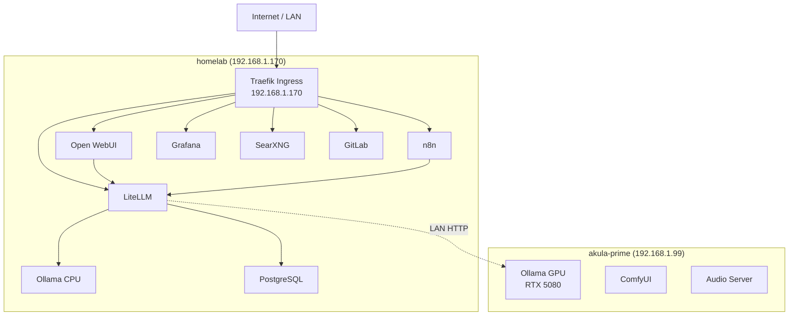

# Network Topology

## Overview

- **Ingress**: Traefik on homelab node (192.168.1.170)
- **DNS**: `*.vectorweight.com` resolves to 192.168.1.170
- **TLS**: Self-signed CA (cert-manager) with wildcard certificate
- **Service Mesh**: Linkerd for mTLS between pods

## Network Diagram

## External Access (HTTPS)

All external endpoints are served via Traefik with TLS termination using the wildcard certificate `vectorweight-wildcard-tls`.

| Hostname | Service | Port |
|----------|---------|------|
| `ai.vectorweight.com` | Open WebUI | 443 |
| `llm.vectorweight.com` | LiteLLM | 443 |
| `n8n.vectorweight.com` | n8n | 443 |
| `argocd.vectorweight.com` | ArgoCD | 443 |
| `grafana.vectorweight.com` | Grafana | 443 |
| `search.vectorweight.com` | SearXNG | 443 |
| `git.vectorweight.com` | GitLab | 443 |
| `docs.vectorweight.com` | Documentation | 443 |

## Internal Access (ClusterIP)

| Service | DNS | Port |
|---------|-----|------|
| Ollama CPU | `ollama.self-hosted-ai` | 11434 |
| Ollama GPU | `ollama-gpu.gpu-workloads` | 11434 |
| PostgreSQL | `postgresql.self-hosted-ai` | 5432 |
| Redis | `redis.self-hosted-ai` | 6379 |
| Tempo | `tempo.monitoring` | 3100 |
| OTel Collector | `otel-collector-opentelemetry-collector.monitoring` | 4318 |

## GPU Worker Access

The GPU worker at 192.168.1.99 is accessed via HTTP over LAN (see [ADR-010](adrs.md#adr-010-gpu-over-lan-architecture)):

- Ollama GPU: `http://192.168.1.99:11434`
- ComfyUI: `http://192.168.1.99:8188`
- Whisper STT: `http://192.168.1.99:9000`
