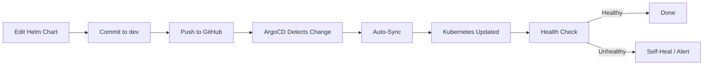

# ArgoCD & GitOps

## App-of-Apps Pattern

All services are deployed using ArgoCD's App-of-Apps pattern. Each service has an `Application` manifest in `argocd/applications/` that points to its Helm chart.

```
argocd/applications/
├── sealed-secrets.yaml      # Wave -2
├── cert-manager.yaml        # Wave -1
├── traefik.yaml             # Wave 0
├── resource-quotas.yaml     # Wave 0
├── ollama.yaml              # Wave 5
├── litellm.yaml             # Wave 5
├── open-webui.yaml          # Wave 6
├── n8n.yaml                 # Wave 6
└── docs-site.yaml           # Wave 6
```

## Application Structure

Each ArgoCD application follows this template:

```yaml
apiVersion: argoproj.io/v1alpha1
kind: Application
metadata:
  name: <service-name>
  namespace: argocd
  annotations:
    argocd.argoproj.io/sync-wave: "<wave-number>"
spec:
  project: default
  source:
    repoURL: https://github.com/tzervas/self-hosted-ai.git
    targetRevision: main
    path: helm/<service-name>
  destination:
    server: https://kubernetes.default.svc
    namespace: <target-namespace>
  syncPolicy:
    automated:
      prune: true
      selfHeal: true
    syncOptions:
      - CreateNamespace=true
```

## Common Operations

### Check Sync Status

```bash
# List all applications
argocd app list

# Get details for a specific app
argocd app get <app-name>

# Watch sync progress
argocd app get <app-name> --watch
```

### Manual Sync

```bash
# Sync a specific app
argocd app sync <app-name>

# Sync with prune (remove orphaned resources)
argocd app sync <app-name> --prune

# Sync all apps
argocd app sync --all
```

### Troubleshoot Sync Failures

```bash
# View sync details
argocd app get <app-name> --show-operation

# View diff between desired and live state
argocd app diff <app-name>

# View events
kubectl get events -n <namespace> --sort-by='.lastTimestamp'
```

## GitOps Workflow


