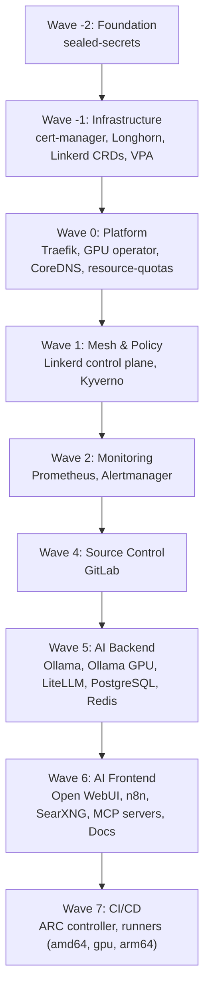

# Sync Waves

ArgoCD deploys services in a specific order using sync waves. Lower wave numbers deploy first.

## Wave Order



## Detailed Wave Breakdown

### Wave -2: Foundation

| Service | Purpose |
|---------|---------|
| sealed-secrets | Encrypted secrets in Git -- must exist before any secrets |

### Wave -1: Infrastructure

| Service | Purpose |
|---------|---------|
| linkerd-crds | Service mesh CRDs |
| cert-manager | TLS certificate lifecycle |
| longhorn | Block storage |
| vpa | Resource recommendations |

### Wave 0: Platform

| Service | Purpose |
|---------|---------|
| traefik | Ingress controller |
| gpu-operator | GPU support |
| coredns-custom | DNS customization |
| resource-quotas | Namespace limits |
| cert-manager-issuers | TLS certificate issuers |

### Wave 1: Service Mesh & Policy

| Service | Purpose |
|---------|---------|
| linkerd-control-plane | mTLS and observability |
| linkerd-viz | Service mesh dashboard |
| kyverno | Pod security policies |

### Wave 2: Monitoring

| Service | Purpose |
|---------|---------|
| prometheus | Metrics collection |
| alertmanager | Alert routing |

### Wave 5: AI Backend

| Service | Purpose |
|---------|---------|
| ollama | CPU inference |
| ollama-gpu | GPU inference |
| litellm | OpenAI-compatible API gateway |
| postgresql | Database |
| redis | Cache/queues |
| keycloak | SSO identity provider |

### Wave 6: AI Frontend

| Service | Purpose |
|---------|---------|
| open-webui | Chat interface |
| n8n | Workflow automation |
| searxng | Web search |
| mcp-servers | AI agent tools |
| docs-site | Documentation |

### Wave 7: CI/CD

| Service | Purpose |
|---------|---------|
| arc-controller | GitHub Actions runner controller |
| arc-runners-amd64 | Standard runners |
| arc-runners-gpu | GPU-accelerated builds |
| arc-runners-arm64 | ARM64 multi-arch builds |
| gitlab-runners | GitLab CI runners |

## Service Dependency Chain

```
SealedSecrets Controller
    |
Traefik (ingress)
    |
cert-manager (TLS)
    |
PostgreSQL, Redis
    |
Keycloak (SSO)
    |
oauth2-proxy (auth middleware)
    |
Ollama (CPU/GPU), LiteLLM
    |
Open WebUI, n8n, SearXNG
```
