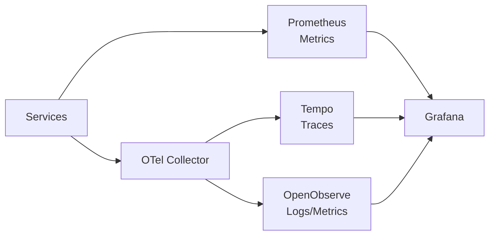

# Monitoring

## Stack Overview



## Dashboards

| Dashboard | URL | Purpose |
|-----------|-----|---------|
| Grafana | [grafana.vectorweight.com](https://grafana.vectorweight.com) | Unified observability UI |
| Prometheus | [prometheus.vectorweight.com](https://prometheus.vectorweight.com) | Raw metrics query |
| OpenObserve | [observe.vectorweight.com](https://observe.vectorweight.com) | Logs, metrics, traces |

## Distributed Tracing

### Tracing Endpoints

| Service | Endpoint | Purpose |
|---------|----------|---------|
| Tempo | `http://tempo.monitoring:3100` | Trace storage and query |
| OpenObserve | `https://observe.vectorweight.com` | Logs, metrics, traces UI |
| OTel Collector | `http://otel-collector-opentelemetry-collector.monitoring:4318` | OTLP/HTTP receiver |

### Querying Traces

Via Grafana Explore:

1. Navigate to Grafana > Explore
2. Select "Tempo" datasource
3. Search by service name, trace ID, duration, or tags

**Example TraceQL queries**:

```traceql
# Find slow LiteLLM requests (>5s)
{service.name="litellm"} | duration > 5s

# Find errors
{service.name="litellm" && status=error}

# Find specific model requests
{service.name="litellm" && resource.model="qwen2.5-coder:14b"}
```

### Instrumented Services

| Service | Status | Span Types |
|---------|--------|------------|
| LiteLLM | Enabled | HTTP requests, LLM inference, model routing |
| Open WebUI | Enabled | HTTP requests, database queries, API calls |
| n8n | Enabled | Workflow executions, node operations |

### Trace-to-Logs Correlation

Grafana supports jumping from traces to related logs:

1. In Grafana Explore, view a trace
2. Click "Logs for this span" button
3. Automatically queries OpenObserve for matching logs

## Common Monitoring Commands

```bash
# Check resource usage
kubectl top pods -A --sort-by=memory

# Check Ollama model memory
curl http://192.168.1.99:11434/api/ps | jq

# Check OTel Collector
kubectl get pods -n monitoring -l app.kubernetes.io/name=opentelemetry-collector

# Check Tempo metrics
curl 'http://tempo.monitoring:3100/metrics'
```
