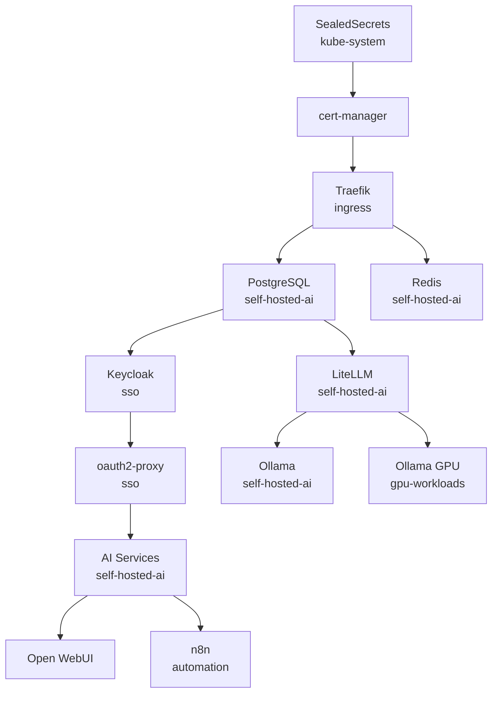

# Namespace Reference

## Active Namespaces

| Namespace | Purpose | Key Services |
|-----------|---------|--------------|
| `argocd` | GitOps control plane | ArgoCD server, repo-server, dex |
| `cert-manager` | TLS certificate management | cert-manager, issuers, CA |
| `automation` | Workflow orchestration | n8n, workflow triggers |
| `self-hosted-ai` | Core AI services | Open WebUI, LiteLLM, Ollama CPU, PostgreSQL, Redis, MCP servers |
| `gpu-workloads` | GPU-accelerated AI | Ollama GPU, audio-server, video-server, TTS |
| `monitoring` | Observability | Prometheus, Grafana, Tempo, OTel Collector |
| `sso` | Identity and access | Keycloak, oauth2-proxy |
| `ingress` | External access | Traefik |
| `longhorn-system` | Storage | Longhorn controller, CSI driver |
| `linkerd` | Service mesh | Linkerd control plane |
| `kyverno` | Policy enforcement | Kyverno |
| `arc-systems` | Runner controller | ARC controller |
| `arc-runners` | CI/CD runners | GitHub Actions Runner pods |
| `gitlab` | Source control | GitLab, GitLab runners |

## Service Dependencies

## Resource Quotas

Each namespace has ResourceQuotas configured. See [Resource Management](../architecture/resources.md) for details.
