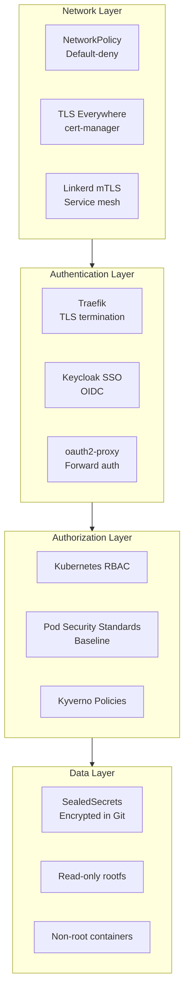

# Security Overview

## Defense in Depth

The platform implements multiple security layers:



## Pod Security Standards (PSS)

The platform enforces **PSS Baseline** on AI workload namespaces:

- `ai-services`: baseline
- `gpu-workloads`: baseline
- `automation`: baseline

**Enforced Controls**:

- `seccompProfile: RuntimeDefault`
- `allowPrivilegeEscalation: false`
- `capabilities.drop: ALL`
- Prevents privileged containers
- Prevents host namespace access

```bash
# View PSS labels on namespace
kubectl get namespace ai-services -o jsonpath='{.metadata.labels}' | jq

# Test if a pod violates PSS (dry-run)
kubectl apply --dry-run=server -f pod.yaml
```

## NetworkPolicy

All AI namespaces have default-deny NetworkPolicies with explicit allow-rules:

```bash
# List NetworkPolicies
kubectl get networkpolicies -n ai-services
kubectl get networkpolicies -n gpu-workloads

# Test network connectivity
kubectl run -it --rm nettest --image=busybox -n ai-services -- \
  wget -T 5 https://huggingface.co
# Should succeed (allowed by allow-model-downloads policy)
```

## Key Security Features

| Feature | Implementation | Purpose |
|---------|---------------|---------|
| Encrypted secrets | SealedSecrets | Secrets safe in Git |
| TLS everywhere | cert-manager + internal CA | Encrypted communication |
| SSO | Keycloak + oauth2-proxy | Centralized authentication |
| Non-root containers | `runAsNonRoot: true` | Reduced attack surface |
| Network policies | Kubernetes NetworkPolicy | Network segmentation |
| Service mesh | Linkerd mTLS | Encrypted pod-to-pod traffic |
| Read-only filesystems | `readOnlyRootFilesystem: true` | Prevent tampering |

For detailed security topics, see:

- [TLS & Certificates](tls-certificates.md)
- [Secrets Management](secrets.md)
- [SSO Integration](sso.md)
- [Security Audit](audit.md)
