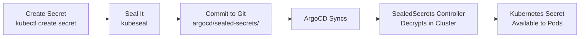

# Secrets Management

## SealedSecrets Workflow

All secrets are encrypted using Bitnami SealedSecrets and stored safely in Git:



## Creating a Sealed Secret

```bash
# 1. Create a regular secret (dry-run)
kubectl create secret generic my-secret \
  --from-literal=key=value \
  --dry-run=client -o yaml > secret.yaml

# 2. Seal it
kubeseal --format yaml < secret.yaml > sealed-secret.yaml

# 3. Move to sealed-secrets directory
mv sealed-secret.yaml argocd/sealed-secrets/

# 4. Commit and push
git add argocd/sealed-secrets/sealed-secret.yaml
git commit -m "feat(secrets): add my-secret sealed secret"
```

## Credential Lifecycle

1. **Generation**: `uv run scripts/secrets_manager.py generate`
2. **Storage**: SealedSecrets in Git, documentation in local file
3. **Rotation**: `uv run scripts/secrets_manager.py rotate --all` (monthly)
4. **Access**: `ADMIN_CREDENTIALS.local.md` (gitignored)

## Available Secrets

Secrets stored in `argocd/sealed-secrets/`:

- OIDC client credentials (n8n, searxng, litellm, grafana, etc.)
- OAuth application secrets (GitLab, ArgoCD)
- Database credentials (PostgreSQL)
- API tokens (Keycloak admin, GitLab root)
- GHCR pull secrets

## Keycloak Secret Generation

```bash
# Generate all Keycloak/OIDC secrets
scripts/setup-keycloak-secrets.sh

# Verify secrets
kubectl get sealedsecrets -A
```

!!! warning "Backup the Sealing Key"
    The SealedSecrets controller encryption key in `kube-system` namespace is critical. If lost, all sealed secrets become unrecoverable. Back it up to a secure, offline location.
