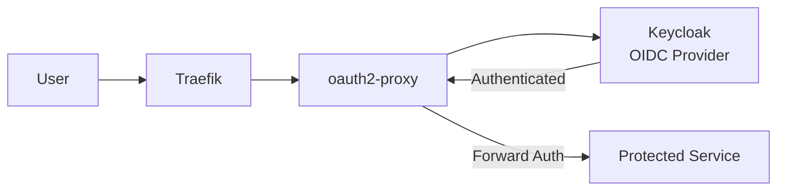

# SSO Integration

## Architecture



## Keycloak Setup

Keycloak runs in the `sso` namespace and provides OIDC authentication for all services.

**Access**: [keycloak.vectorweight.com](https://keycloak.vectorweight.com)

### Realm Configuration

```bash
# Automated realm setup
scripts/setup-keycloak-realm.sh
```

This creates:

- Realm with users (admin, kang, spooky)
- OIDC clients for each service
- Role mappings

### OIDC Clients

Each service that needs SSO has an OIDC client registered in Keycloak:

| Client | Service | Redirect URI |
|--------|---------|-------------|
| n8n | n8n | `https://n8n.vectorweight.com/rest/oauth2-callback` |
| searxng | SearXNG | `https://search.vectorweight.com/oauth2/callback` |
| grafana | Grafana | `https://grafana.vectorweight.com/login/generic_oauth` |
| gitLab | GitLab | `https://git.vectorweight.com/users/auth/openid_connect/callback` |

## oauth2-proxy

The oauth2-proxy service acts as a forward-auth middleware for Traefik, protecting services that do not have built-in OIDC support.

**Configuration**: `helm/oauth2-proxy/values.yaml`

### Adding SSO to a New Service

1. Create OIDC client in Keycloak
2. Generate SealedSecret with client credentials
3. Add forward-auth middleware to the service's IngressRoute
4. Test authentication flow

## Users

| User | Role | Access |
|------|------|--------|
| admin | Administrator | Full access |
| kang | Power user | All services |
| spooky | Regular user | Limited access |
